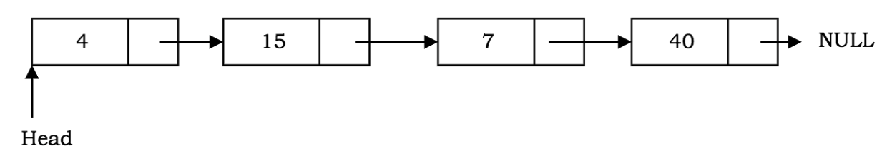

# Linked Liste

Eine verknüpfte Liste ist eine geordnete Sammlung von Datenelementen. Ein Datenelement kann als Knoten in einer verketteten Liste dargestellt werden. Jeder Knoten besteht aus zwei Teilen: Daten & Zeiger auf den nächsten Knoten .

Im Gegensatz zu Arrays werden Datenelemente nicht an zusammenhängenden Stellen gespeichert. Die Datenelemente oder Knoten werden mit Hilfe von Zeigern verknüpft, daher eine verkettete Liste genannt .

Eine verknüpfte Liste hat die folgenden Eigenschaften: 
- Aufeinanderfolgende Knoten sind durch Zeiger verbunden.
- Der letzte Knoten zeigt auf null.
- Es headwird ein Zeiger geführt, der auf den ersten Knoten der Liste zeigt.
- Eine verknüpfte Liste kann während der Ausführung des Programms wachsen und schrumpfen.
- Es kann so lange wie nötig gemacht werden.
- Es weist Speicher zu, wenn die Liste wächst. Im Gegensatz zu Arrays, die eine feste Größe haben. Daher muss die Obergrenze für die Anzahl der Elemente im Voraus bekannt sein. Im Allgemeinen ist der zugewiesene Speicher unabhängig von der Nutzung gleich der Obergrenze. Dies ist einer der Hauptvorteile der Verwendung einer verketteten Liste gegenüber einem Array.

## Ein weiterer Vorteil einer verknüpften Liste
Im Gegensatz zu einem Array, das Daten zusammenhängend im Speicher speichert, kann eine verkettete Liste problemlos Knoten in die Liste einfügen oder daraus entfernen , ohne die gesamte Datenstruktur neu zu organisieren.

Wenige Nachteile:
Ein wahlfreier Zugriff auf Datenelemente ist nicht erlaubt. Auf die Knoten muss sequentiell, beginnend mit dem ersten, zugegriffen werden. Daher ist der Suchvorgang in einer verknüpften Liste langsam.
Es verwendet mehr Speicher als Arrays aufgrund des Speicherplatzes, der von ihren Zeigern verwendet wird.

## Einfach verknüpfte Liste

Eine einfach verknüpfte Liste ist eine Sammlung von Knoten, wobei jeder Knoten zwei Teile hat: Daten und einen Zeiger auf den nächsten Knoten. Die Liste endet mit einem Knoten, der auf zeigt null.

# Flussdiagram

