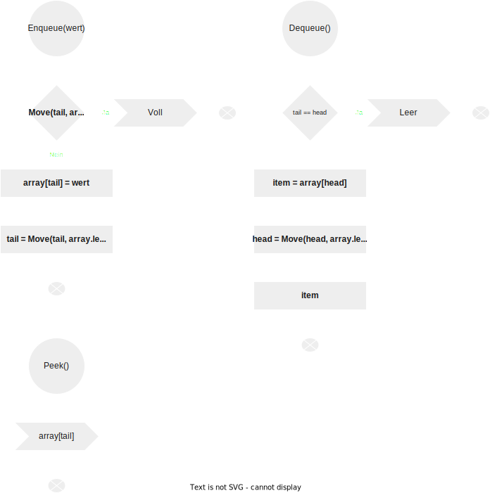

# Queue 

Eine Queue ist eine geordnete Liste von Elementen, bei der ein Element am Ende der Queue eingefügt und am Anfang der Queue entfernt wird.

Eine Queue funktioniert nach dem First-in-First-out-Prinzip (FIFO), was sich von einem Stack unterscheidet , der nach dem Last-in-First-out-Prinzip (LIFO) arbeitet.

Eine Queue hat zwei Hauptoperationen:

- Fügen am Ende der Queue ein neues Element ein, das enqueue genannt wird.
- Entfernen ein Element vom Anfang der Queue, das als Dequeue bezeichnet wird.

Das folgende Bild zeigt eine Queue:

Eine weitere wichtige Operation einer Queue ist das Abrufen des Elements an der Vorderseite namens peek . Anders als bei der Dequeue- Operation gibt die Peek - Operation das Element an der Vorderseite zurück, ohne die Queue zu ändern.

Der Name  Queue kommt von der Analogie zu einer Kundenschlange bei einer Bank. Der Kunde, der zuerst kommt, wird zuerst bedient, und der Kunde, der später kommt, wird am Ende der Queue eingereiht und später bedient.

# Flussdiagram

