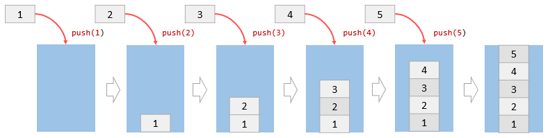
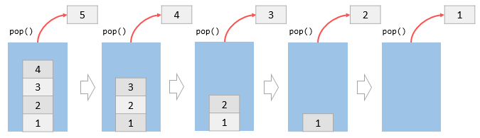
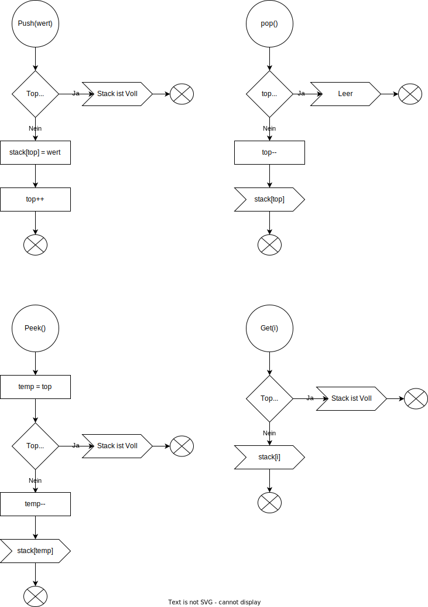

# Stack

Ein Stapel ist eine Datenstruktur, die eine Liste von Elementen enthält. Ein Stapel funktioniert nach dem LIFO-Prinzip, dh Last In, First Out, was bedeutet, dass das zuletzt hinzugefügte Element als erstes entfernt wird.

Ein Stack hat zwei Hauptoperationen, die nur am Anfang des Stacks stattfinden: Push und Pop. Die Push-Operation platziert ein Element an der Spitze des Stapels, während die Pop-Operation ein Element von der Oberseite des Stapels entfernt.

Der Name Stack kommt von der Analogie zu einer Reihe von physischen Gegenständen, z. B. DVDs, Bücher, die übereinander gestapelt sind.

Ein Stapel hat viele Anwendungen. Am einfachsten ist es beispielsweise, ein Wort umzukehren. Dazu schiebt man ein Wort Buchstabe für Buchstabe in den Stapel und holt die Buchstaben aus dem Stapel.

## push()-Methode 

Mit der push()Methode kann man ein oder mehrere Elemente am Ende des Arrays hinzufügen. Die push()Methode gibt den Wert der lengthEigenschaft zurück, die die Anzahl der Elemente im Array angibt.

Die folgende Abbildung veranschaulicht jeden Schritt im obigen Skript.

Anfangs ist der Stack leer. Jedes Mal rufen die push()Methode auf, um dem Stack eine Zahl hinzuzufügen. Nach 5 Aufrufen hat der Stack 5 Elemente.

## pop()-Methode

Die pop()Methode entfernt das Element am Ende des Arrays und gibt das Element an den Aufrufer zurück. Wenn das Array leer ist, gibt die pop()Methode undefined zurück .

Anfänglich hat der Stack 5 Elemente. Die pop()Methode entfernt das Element am Ende des Arrays, dh an der Spitze des Stapels, eines nach dem anderen. Nach fünf Operationen ist der Stack leer.

# Flussdiagram

