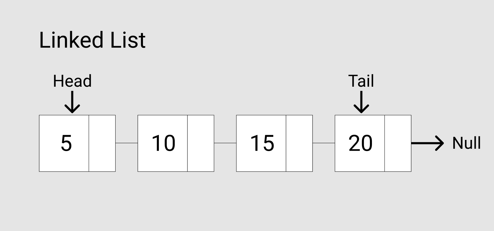
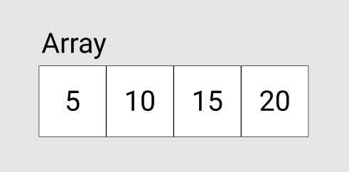
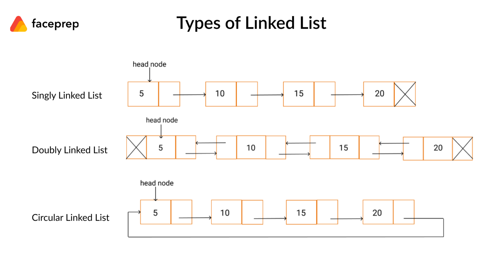

# Stack Queue LinkedList 

I know there are many people already writing about data structures topics out there, but I believe the best and fast way to learn for me is to write an article about it. For that reason, I decided to have a journal of each data structure topic.

Data structures are crucial topics that you often get asked in the technical interview but also help your problem-solving skills in algorithms. There are many ways of solving an algorithm question to get the result. Sometimes you could solve it the hard or easy way, and it all depends on your data structures knowledge. Or sometimes, the solution is not optimized due to not knowing the fundamental concept of data structures. So, let’s start learning the two most common data structures in computer science Stack and Queue and LinkedList.


# What is a Stack?

The last element added to the stack will be the first element removed from the stack. Last In First Out (LIFO) method mantra is what stack is known. In real life, examples of the stack could be a pile of plates, books, and papers. To get the middle of a collection of the book, you will need to remove the book on top of it first. It means that the last book that comes in a pile will be the first book to get removed from the collection (the top of the book). 

A stack has two main operations that take place only at the beginning of the stack: Push and Pop. The push operation places an element at the top of the stack, while the pop operation removes an element from the top of the stack.

The name stack comes from the analogy to a series of physical objects, e.g. DVDs, books, stacked on top of each other.

A stack has many applications. For example, the easiest way is to reverse a word. To do this, you push a word letter by letter into the stack and get the letters from the stack. or Stacks used where:

- Managing function invocations ,recursion function
- Undo/Redo, (those “control + z” or “command + z”)
- Routing route(the history object) in front end framework such as react

## push()-Method

The push() method can be used to add one or more elements to the end of the array. The push() method returns the value of the length property, which specifies the number of elements in the array.

The following figure illustrates each step in the above script.


Initially the stack is empty. Each time call the push() method to add a number to the stack. After 5 calls the stack has 5 elements.

## pop()-Method


The pop()method removes the element at the end of the array and returns the element to the caller. If the array is empty, the pop() method returns undefined.


Initially the stack has 5 elements. The pop() method removes the element at the end of the array, i.e. at the top of the stack, one by one. After five operations the stack is empty.

----

Now that we understand the concept let’s implement a stack with an array. There is more that one way of achieving a stack.

Here is my version in C#:


```C#
    class Stack {
        public bool makeBigger;
        public aStack(bool _makeBigger) {
            makeBigger = _makeBigger;
        }

        aArray<string> aAr = new aArray<string>();

        static string[] stack = new string[10];
        static int top = 0;
        public void push(string Wert) {
            if (top >= stack.Length) {
                if (makeBigger == true) {
                    stack = aAr.IncreaseSize(stack, 10);
                    stack[top] = Wert;
                    top++;
                    return;
                }

                throw new Exception("Stack is full");
            }
            stack[top] = Wert;
            top++;

        }

        public string pop() {
            if (top <= 0) {
                throw new Exception("Stack is full");
                return null;
            }
            top--;
            return stack[top];
        }

        public string peek() {
            int temp = top;

            if (top <= 0) {
                throw new Exception("Stack is full");
                return null;
            } else {
                temp = temp - 1;
            }
            return stack[temp];
        }
        public string get(int i) {
            if (top <= 0) {
                throw new Exception("Stack is full");
                return null;
            } else {
                return stack[i];
            }
        }
        public void clean(){
            stack = new string[10];
        }
    }
```

# Flussdiagram


# What is a Queue?

A Queue is similar to stack but works the opposite way. First In First Out (FIFO) the same as Last In Last Out (LILO). In terms of real-life situations, think about waiting in a line at the DMV. The first person usually gets in is the first person often to get out. Queues used where:

- In an online video game where someone will join last, and someone will join first.
- Uploading resources (download and upload something in your computer depending on the size of the file)
- Background tasks on your computer
- Printing/Task processing (a printer can only handle one thing at a time on a time, and whoever hit the print first in the public library that person will get his/her stuff print first)


There are two terms in a queue; an enqueue and dequeue. An enqueue is the insertion, and a dequeue is the deletion of an element. Now we have the bigger picture, let’s dive into the implementation part. Again, there are many ways of implementing queues.

Here is my version in C#:

```C#
   class queue {
        public bool makeBigger;
        public queue(bool _makeBigger) {
            makeBigger = _makeBigger;
        }

        aArray<string> aAr = new aArray<string>();

        static string[] array = new string[5];

        static int tail = 0;
        static int head = 0;

        public void Enqueue(string Wert) {
            if (Move(tail, array.Length) == head) {
                if (makeBigger == true) {
                    array = aAr.IncreaseSize(array, 10);
                    array[tail] = Wert;
                    tail = Move(tail, array.Length);
                    return;
                }
                Console.WriteLine("Voll");
                return;
            } else {
                array[tail] = Wert;
                tail = Move(tail, array.Length);
            }
        }

        public string Dequeue() {
            string answer = "";
            if (tail == head) {
                return "leer";
            }
            answer = array[head];
            head = Move(head, array.Length);
            return answer;
        }
        private int Move(int counter, int length) {
            if (counter > length - 1) {
                return 0;
            }
            return ++counter;
        }
    }
```
Another important operation of a queue is to retrieve the element at the front called peek . Unlike the dequeue operation, the peek operation returns the element at the front without changing the queue.

The name queue comes from the analogy to a customer queue at a bank. The customer who comes first is served first, and the customer who comes later is placed at the end of the queue and served later.


# Flussdiagram


---
# What is a Linked List?

A linked list is an ordered collection of data items. A data item can be represented as a node in a linked list. Each node consists of two parts: Data & pointer to the next node. Check the illustration down below:
<div style="display: flex; flex-direction: row; margin-top: 56px;" >

     
</div>
<br>
The head pointing(reference) to the first node (element) in the linked list also includes the entry of the linked list. The last node of the list points to null, which is also the tail. The tail is a particular node, where the next pointer is always pointing or reference to null, indicating the end of the list. If the list is empty, the head points to the null.

Linked List visualization in javascript:

```Js
const Linkedlist = {
    head: {
        value: 6
        next: {
            value: 10                                             
            next: {
                value: 12
                next: {
                    value: 3
                    next: null	
                    }
                }
            }
        }
    },
    tail:{
        value:null,
        next:null
    }
}
```

## Advantage
  The insertion and deletion operation in the linked list is O(1) time complexity faster than the array. Unlike in an array, nodes are also easy to remove and add to the linked list without reorganizing the entire data structure.


## Disadvantage
- The search operation is slower than the array since nodes need to access starting from the first node and go through each node at a time to find the element. In contrast, array, we can access the data index element randomly (ex: array[4], not in the linked list case).
- Uses more memory to store additional pointers for linked lists than in arrays.

## Three types of linked list
- **Singly Linked Lists**: each node only pointing to the next node. The above example is all singly-linked lists.
- **Doubly Linked Lists**: each node has two pointers, a pointer to the next node and a pointer to the previous node.
- **Circular Linked Lists**: Similar to a singly linked list except the last node points to the first node of the list, forming a loop.
 



Unlike arrays, data elements are not stored in contiguous locations. The data elements or nodes are linked using pointers, hence called a linked list .

A linked list has the following properties: 
- Successive nodes are connected by pointers.
- The last node points to zero.
- A pointer is kept at the head pointing to the first node of the list.
- A linked list can grow and shrink during the execution of the program.
- It can be made as long as necessary.
- It allocates memory as the list grows. Unlike arrays, which have a fixed size. Therefore, the upper limit on the number of elements must be known in advance. In general, the allocated memory is equal to the upper limit regardless of usage. This is one of the main advantages of using a linked list over an array.

## Another advantage of a linked list

Unlike an array, which stores data contiguously in memory, a linked list can easily insert or remove nodes from the list , without reorganizing the entire data structure.

Few disadvantages: Random access to data elements is not allowed. Nodes must be accessed sequentially, starting with the first one. Therefore, the search process in a linked list is slow. It uses more memory than arrays because of the memory used by their pointers.

## Simple linked list

A simply linked list is a collection of nodes, where each node has two parts: Data and a pointer to the next node. The list ends with a node that points to zero.


# Flussdiagram


Resources:


[](https://www.youtube.com/watch?v=WwfhLC16bis)

It is about the implementation of stack and queue in an array and linked list. Thanks for reading and I hope you can learn something from the article.
